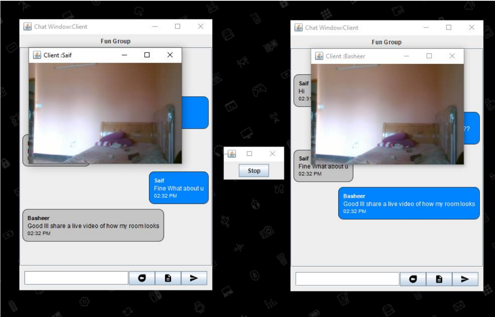

# Group Chat App With Encrypted Messaging and Video Streaming
A Simple Group Chat Application is written in Java and has features like Encrypted Messaging, Video Streaming and File Transfer.

## Features
 ✅ AES 256 based message Encryption.
 
 ✅ Live (webcam) Video/Audio Transmistion .
 
 ✅ Supports File Transfer Upto 2 Gb.
 
 ✅ All file format supported for File Transfer.
 
 ✅ Uses TCP/IP Protocol for Message Transfer
 
 ## Getting Started

These instructions will get you a copy of the project up and running on your local machine for development and testing purposes.

### Prerequisites

Things you need to run the software
  - Java 8 or Above
  - Add the JARS provided in the lib folder to classpath or Add the JARS directly to your IDE's (In VS CODE add it to Referenced Library as per image)

  

## Running The App

Run the Server.java first. 

Then Run as many Clients as you want. 

When opening the first client you can enter any password but for the rest of the clients you need to enter the same password (ie: the first client sets the password for the server)
| Login Screen | Chat Window|
|---|---|
|

<b>Multi Chat</b>
| 
<b>Video Streaming</b>

|

## Built With

* [Java 16](https://www.java.com/en/) - The Programming Language used. [Min Ver 8 required]
* [Java Swing](https://en.wikipedia.org/wiki/Swing_(Java)) -The UI Framework used.
* [Webcam Capture](https://github.com/sarxos/webcam-capture) - Used for geting data from webcam.
* [Apache Commons](https://commons.apache.org/) -Used for encryption related methods.

## License

This project is licensed under the MIT License - see the [LICENSE.md](LICENSE) file for details

***
> Feel free to star ⭐ this repository if you like what you see 😉.
